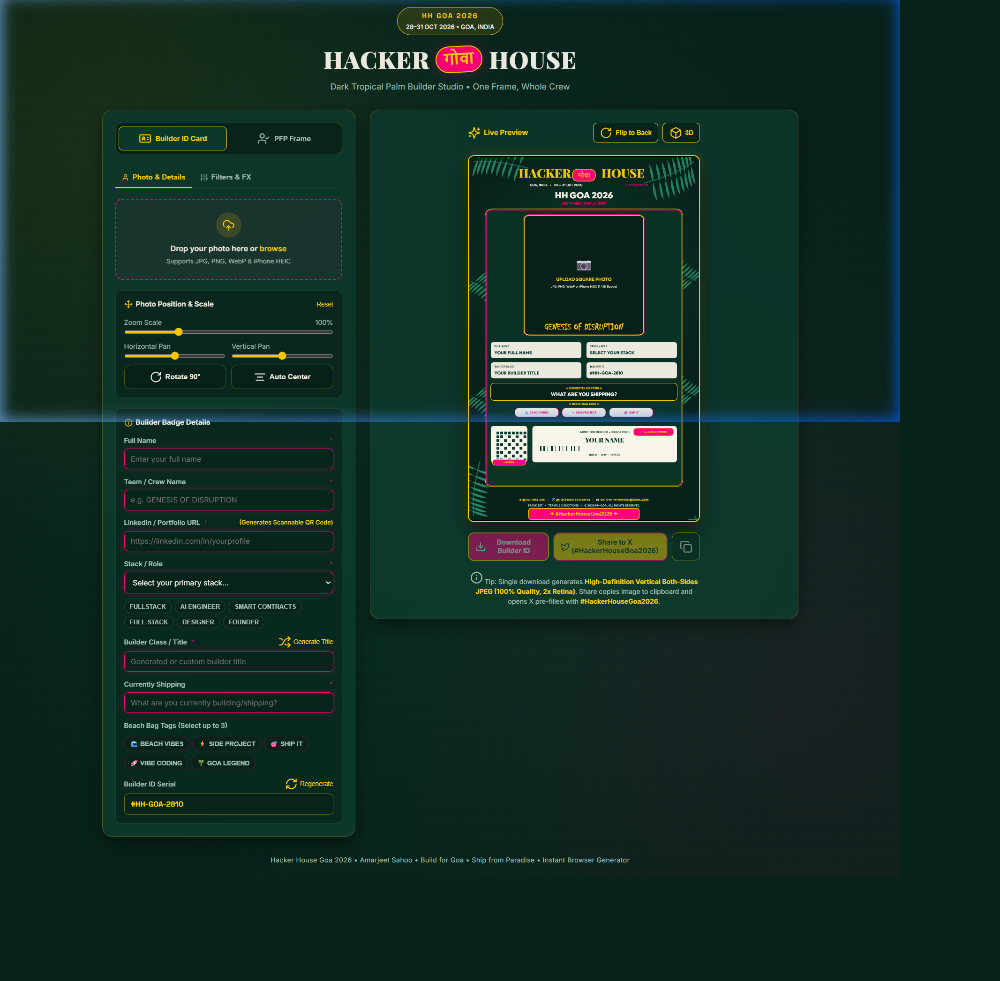

# 🌴 Hacker House Goa 2026 — Builder ID Studio

An interactive, high-fidelity browser-based studio for attendees of **Hacker House Goa 2026** to customize and generate their official event credentials and social media PFP avatar overlays. 

Built completely in a **Dark Tropical Palm** design system matching the aesthetic of the hackathon.

---

## 📸 Builder ID Template Preview

Below is the export layout generated by the studio (showing both the Front and Back card surfaces stacked vertically):



---

## 📅 Event Details
- **Event Name:** Hacker House Goa 2026
- **Dates:** 28 – 31 October 2026
- **Location:** Goa, India
- **Tagline:** One Frame, Whole Crew
- **Hashtags:** `#HackerHouseGoa2026` | `#FrameInGoa`

---

## 🎨 Visual Design Theme
The application adopts the authentic **Dark Tropical Palm** brand guidelines:
- **Forest Green Background (`#07221a`):** Deep radial gradients suggesting tropical forest foliage.
- **Palm Leaf Accents:** Hand-rendered tropical branches framing the corners of the badges and frames.
- **Devanagari Badge (`गोवा`):** Bright pink badge with yellow borders celebrating the spirit of Goa.
- **Pink & Gold Accents (`#ff007a` & `#ffd000`):** Punchy ticket-stub dashed cut-lines, highlighted text fields, and barcode graphics.

---

## 🛠️ Application Stack
- **Bundler & Dev Server:** [Vite](https://vite.dev/) (v6+)
- **Graphics Engine:** HTML5 Canvas 2D API (runs entirely on client-side, zero server requirements)
- **Styling:** Vanilla CSS (flexbox, CSS variables, and native 3D perspective transforms)
- **Dependencies:**
  - `canvas-confetti` (for celebration particles)
  - `heic2any` (for iPhone HEIC photo uploads)
  - `lucide` (for UI icons)
  - `qrcode` (for scannable LinkedIn QR code generation)

---

## 🚀 Key Features

### 1. Format Switcher
- Toggle between two formats:
  - **Builder ID Card:** 2-sided vertical event credential pass (`1000px × 1580px` canvas base).
  - **PFP Frame:** 1:1 square profile picture frame with corner palm leaf accents and hashtag ribbon (`1000px × 1000px` canvas base).

### 2. Interactive 3D Perspective Card Tilt
- Active 3D perspective tracking rotates the preview card a full **360 degrees** interactively as you move your mouse over the preview area.
- Automatic **mirroring correction** flips the graphics past the 90° mark, rendering the actual Back Side details (LinkedIn QR, Event Rules, Barcode) upright and unmirrored.

### 3. Quick Stack Role Pills
- One-click buttons to instantly choose popular hacker roles (`FULLSTACK`, `AI ENGINEER`, `SMART CONTRACTS`, etc.), which pre-populate your builder title automatically.

### 4. Interactive Photo Adjustments
- Real-time photo transformation sliders (Zoom, Pan X, Pan Y, and 90° rotation) and image filters (Vivid, Sunset, Vintage, Cyber, Monochrome) to fit any portrait.

### 5. Official Event Rules & Code of Conduct
- Embedded guidelines on the back side of the card with custom icon indicators:
  - **🪪 Visible Badge:** Mandatory badge on venue premises.
  - **💻 Build & Ship:** Commit original code during hackathon hours.
  - **🌴 Respect the Vibe:** Support fellow hackers and maintain sportsmanship.
  - **☕ 24/7 Refuel:** Free coconut water, food, and coffee.
  - **⚡ Original Work:** AI & open-source tools allowed with disclosure.

### 6. Combined HD Export & Clipboard Share
- **Download Builder ID:** Generates a high-definition stacked vertical export image (`2000px × 6320px` at 2x Retina resolution) ready for print or save.
- **Share to X:** Automatically copies the generated JPEG blob to the clipboard and opens the X tweet composer. Users can paste (Ctrl+V / Cmd+V) their badge image directly into the post.

---

## 💻 Local Development

1. **Install dependencies:**
   ```bash
   npm install
   ```
2. **Start the development server:**
   ```bash
   npm run dev
   ```
3. **Build for production:**
   ```bash
   npm run build
   ```
